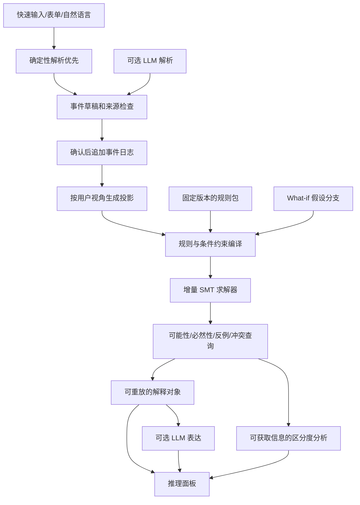

# Clocktower Reasoning Copilot — Technical Design Document

版本：设计草案 0.1｜日期：2026-09-22｜范围：Trouble Brewing、玩家视角、可解释的条件推理。

本设计依据用户附件的 28 节结构。游戏规则事实来自官方 Wiki；系统结构、算法取舍、UX、指标和路线图是设计建议。八人案例的数字由同目录 `verify_walkthrough.py` 实际计算，计数范围是一个明确固定角色袋的假设分支，不是完整 Trouble Brewing 引擎。引用编号对应 `sources.md`。

## 1. Executive Summary

推荐实现一个**假设驱动、时间敏感、携带可复查依据的推理工作台**，而不是“自动寻找恶魔的聊天机器人”。核心资产是规则语义、条件推理、反例与解释，不是 Agent 编排。

产品主循环：快速记录 → 保留来源 → 明确假设 → 查询可满足性 → 给出见证/反例/冲突 → 建议可获取的验证信息。

对原方案的四项修改：

- 不先完整生成世界集合。保留一个符号化可行域，优先回答“可能吗”“必然吗”“需要什么假设”。
- 不提供含糊的 `truthful(player)` 开关。准确复述所见、真实角色、阵营、能力有效是不同命题。
- 没有可辩护的回答模型时，不把世界均匀分布包装成概率，也不输出真实的期望熵下降。
- 先完成不依赖 LLM 的推理核心，再添加语言入口和受限 Agent。

最有说服力的演示是：“这个判断需要哪三条假设；撤掉其中一条，就出现一个可重放的反例。”

## 2. Product Definition

主要用户是同意使用辅助工具的对局玩家，以及复盘中的学习者。默认是**个人私密视角**，不是说书人的全知魔典。训练/复盘真值与玩家数据必须物理或权限隔离。

V1 范围建议限定为标准 7–15 人 Trouble Brewing，排除旅行者、传奇角色、房规和自定义角色。5–6 人作为单独配置版本，不悄悄套用标准设置。Trouble Brewing 角色目录为 13 Townsfolk、4 Outsider、4 Minion、1 Demon。[S1]

主要任务：记录角色与信息声明、比较竞争解释、测试假设、追溯矛盾、回答“还不能排除什么”，以及找到值得核对的来源和问题。

明确不做：未经同意的录音、读取隐藏魔典、给玩家建立跨局“撒谎人格档案”、自动提名/投票、输出无校准的恶魔概率、把说书人风格当作规则。

成功体验：玩家十秒内找到一个之前忽略的反例或关键前提；不是十秒内得到一个看似确定的人名。

## 3. Why This Problem Is Hard

它不是静态的角色排列题。世界至少包含初始角色、角色变化、各时刻存活、行动、持续效果、被展示的信息和逐次判定的 registration。Imp 传位和 Scarlet Woman 接任使“初始恶魔”和“当前恶魔”不能混用。[S7][S8]

另一层困难是语言并不直接观测真值。“3号说看到了某个结果”首先是一个发言事件，既不保证确实收到了该结果，也不保证结果对应真实角色。Drunk 可以准确报告自己看到的 Townsfolk token；这不意味着其真实角色是该 Townsfolk。[S3]

最重要的产品矛盾：若所有发言都允许任意欺骗，则仅增加发言往往不减少硬可行域。这不是求解器失效，而是缺少可识别性。因此要展示**条件下的推理**，不能暗中假定好人全说真话。

还有一个容易忽略的区别：遗漏记录是观测缺失，不是事情没有发生。只有明确标记“本阶段该通道记录完整”，才能推断不存在其他相应事件。

## 4. Core Design Principles

**语义分离。** Truth、Observation、Claim、Evidence、Hypothesis、Conclusion 具有不同类型，禁止用一个 `player.role` 字段承载所有含义。

**推理可追溯。** 每个结论携带规则版本、数据修订、视角、假设、来源、见证或冲突依据。求解器正确不代表编码正确，因此“经求解器验证”不能宣传成整套游戏规则已形式化证明。

**结论有边界。** `unknown` 不是 `unsat`；未找到反例不是反例不存在；找到 20 个世界不是世界总数为 20。

**记录可更正，历史不可暗改。** 用户纠正录入错误和玩家本人改口是两种不同事件。

**软证据不剪枝。** 紧张、晚跳、互保、沉默都不能直接排除合法世界。

**渐进交付。** 未实现机制必须标为 unsupported，或使用明确的保守上近似；不能默认不存在。

## 5. System Architecture



拆为两个不会互相阻塞的循环。记录循环仅做本地解析、确认与持久化；推理循环在独立 Worker 内对不可变 revision 求解。新的输入取消旧结果的展示资格，但不取消已经成功保存的记录。

LLM 不在规则与结论的可信计算边界中。网络断开、模型拒绝或模型返回错误格式时，快捷录入与求解功能继续可用。

## 6. World Model

世界记作：

\[
W=(R_0,R_{0:T},A_{0:T},L_{0:T},X_{0:T},U_{0:T},M_{0:T},G_{0:T})
\]

其中 R 是真实角色，A 是实际阵营，L 是生死状态，X 是中毒/醉酒/保护等效果，U 是行动，M 是实际展示的信息，G 是按 interaction 编号记录的 registration。

额外保存初始展示 token、Fortune Teller 的 red herring、能力实例和使用次数。阵营是单独字段，不能由“被探测到的角色”反推。

三个数据平面：

| 平面 | 含义 | 普通玩家可见内容 |
|---|---|---|
| Hidden world | 一个候选世界的真实历史 | 仅作为明确标记的假设/见证展示 |
| Experienced observation | 玩家实际看到的 token、手势、信号 | 自己的观测或接受报告后的条件观测 |
| Recorded knowledge | 工具记录了什么、谁转述了什么 | 按权限过滤的日志和推导 |

`actualRole=Drunk, shownRole=Investigator` 与 `actualRole=Investigator, poisoned=true` 是两个世界，不是同一个布尔开关的两种名称。[S3][S4]

`registration[target, interaction]` 不能简化为 `registration[target, night]`。Spy/Recluse 可以在同一夜不同角色能力的判定中呈现不同结果；registration 不赋予被呈现角色的能力。[S5][S6]

时间粒度至少达到关键能力结算点。Poisoner 死亡或变成其他角色后，相关持续中毒效果可能在夜晚结束前消失，不能用一个覆盖整夜的布尔值近似后声称精确。[S4][S9]

## 7. Data Model

关系：`RawEntry → Event → Claim/Observation → Evidence → Branch assumptions → Constraints → World witnesses/Conclusions`。

核心接口摘要，完整接口见 `domain.ts`：

```ts
type RoleId = string;
type PlayerId = string;

interface TimePoint {
  phase: 'setup' | 'night' | 'day';
  cycle: number;
  step?: string;
}

interface Claim {
  id: string;
  speakerId: PlayerId;
  kind: 'role' | 'token' | 'ability_report' |
        'action_report' | 'hearsay' | 'opinion';
  aboutTime?: TimePoint;
  content: ObservationPayload | Expr;
  provenance: Provenance;
  visibility: Visibility;
}

interface Branch {
  id: string;
  baseRevision: number;
  rulesetHash: string;
  assumptions: Hypothesis[];
  disabledAssumptionIds: string[];
}
```

输入“3 inv 5/6 baron @n1”至少产生同一 `rawEntryId` 下的两条 Claim：3号声明 Investigator；3号报告 N1 收到 pair=(5,6)、role=Baron 的信息。解析器不能据此写入真实角色、真实调查结果或“5/6必有真实Baron”。

每个事件附 `recordedAt`（录入时刻）、`occurredAt`（游戏时刻，允许未知）、原文跨度、直接/转述来源、来源链、可见范围。两人转述同一来源不能当作两份独立证据。

建议存储表/集合：`games, players, raw_entries, events, branches, notes, rule_manifests, derived_cache`。世界不是必须长期保存的百万行事实表；保存少量解释见证、约束快照和可复现查询即可。

修订区别：用户录错 → `recording_corrected`，重建当前有效记录；玩家改口 → 新的 `claim_recorded`，保留其前后两次发言的关系。撤销假设不能撤销原始事件。

## 8. Rule Representation

不要把中文角色说明直接交给 LLM 编译成约束。采用**数据化角色目录 + 有类型的语义原语 + 经人工审查的角色处理器**。角色扩展点可以有代码；“可扩展”不等于所有未来机制都能靠 JSON 表达。

```yaml
id: poisoner
team: minion
schedule: every_night
selection:
  count: 1
  target_domain: any_player
handler: tb.poisoner.v1
emits:
  effect: poisoned
  starts: after_action_resolution
  nominal_end: next_dusk
  lifecycle: source_bound
source_revision: official-almanac-snapshot
```

语义原语包括 setup adjustment、选择域、效果生命周期、信息函数、可选择 registration、死亡/保护、角色转变、一次性消耗、终局检测。每个 handler 输出约束标签、依赖和可重放执行记录。

角色覆盖矩阵必须覆盖所有 22 个角色：

| 机制组 | 角色 | 必要测试 |
|---|---|---|
| 首夜二选一信息 | Washerwoman / Librarian / Investigator | 正目标、干扰目标、零外来者信息的合法条件、错认 |
| 数值信息 | Chef / Empath | 环形邻接、活邻居、结算时状态、错认 |
| 真假/角色信息 | Fortune Teller / Undertaker / Ravenkeeper | red herring、因处决而死亡、夜死触发、时序 |
| 保护/转移 | Monk / Soldier / Mayor | 保护对象、来源持续性、Mayor 可选转移 |
| 白天能力 | Virgin / Slayer | 首次触发、一次性消耗、错认与醉毒 |
| 特殊外来者 | Butler / Drunk / Recluse / Saint | 投票义务、展示token、错认、特殊失败 |
| 爪牙 | Poisoner / Spy / Scarlet Woman / Baron | 中毒生命周期、魔典视角、接任、初始配比 |
| 恶魔 | Imp | 首夜不杀、自杀传位、目标已死、继任者行动时机 |

特别注意：Baron 修改初始 Townsfolk/Outsider 配比，死亡不撤销；Drunk 的真角色与袋中 Townsfolk token 分开；Imp 传位不能在每个时点继续强制所有人的角色全异；Scarlet Woman 检查恶魔死亡前的存活人数。[S2][S3][S7][S8]

Spy/Recluse 的注册选择、Mayor 的可选转移不能拿“常见说书习惯”剪枝。少见但规则允许的交互需要实现或标记未支持；例如将错认一概限定为“信息角色专用”会漏掉会影响其他能力的交互。[S5][S6][S15]

自我中毒、效果依赖环等边界机制需要专门测试，不得把 `active ↔ not poisoned` 与 `poisoned ↔ active` 直接组合成不合语义的循环方程。这个问题应在规则层解决，不由 LLM 猜测。

## 9. Constraint Solver

选择：**有限域布尔/位向量编码 + 增量 Z3；独立小规模枚举器做测试 oracle。** Z3 支持增量求解与假设、核心等机制；具体编码优劣必须用本项目数据比较。[S18]

Brute force 用于小型差分测试；回溯/CSP 可用于快速预传播；SAT 很适合本问题，但首版直接开发专用 SAT 编译器会增加维护成本；SMT 更方便表示时间索引和结构化状态；概率程序不是 V1 硬规则核心。

模型分为：

\[
F = F_{rules}\land F_{accepted\ observations}\land F_{branch\ assumptions}
\]

角色声明先留在知识层。接受一条能力报告时，再建立“该结果确实被展示”的条件约束；仅当世界中的相关能力有效时，才要求信息满足其规则定义。醉毒信息允许正确，也允许在该消息类型允许的范围内错误。[S4][S10]

Investigator 的规则不能简化成“两个目标真实角色中必有Baron”，还要通过 registration 语义检查。也不要不经核验把“其中一人”编码为 XOR。[S5][S11]

基础查询不需要数出所有世界：

```python
# 伪代码：check 必须区分 sat/unsat/unknown。
def classify(F, phi):
    base = check(F)
    if base == UNSAT:
        return INCONSISTENT_BRANCH
    if base != SAT:
        return UNKNOWN

    yes = check(F & phi)
    no  = check(F & ~phi)
    if yes == UNSAT:
        return IMPOSSIBLE
    if no == UNSAT:
        return NECESSARY
    if yes == SAT and no == SAT:
        return CONTINGENT_WITH_TWO_WITNESSES
    return UNKNOWN
```

先检查分支本身，避免空集合上“所有命题都成立”的 vacuous truth 被 UI 当作确认。见证返回具体合法历史；UNSAT 返回带规则/事件/假设来源的核心。原始 unsat core 不必是最小的，需要预算允许时做 deletion-based 缩减；最小不满足子集不等于基数最小子集。[S18]

必须有因果闭合：不仅有“合法攻击可能造成死亡”的正向约束，还要保证观测死亡具有规则允许的原因，不能允许任意凭空死亡。事件是否完整、是否已经终局、强制触发是否遗漏，都参与验证。

## 10. Hypothesis Search

UI 的“相信3号”展开为可组合但不同的假设：准确报告所见 token；准确复述这条能力信息；真实角色是 Investigator；N1 该能力有效；实际阵营为 good。默认不联动开启。

每个分支绑定数据修订与规则哈希。启用假设是添加 assumption literal，关闭是从该分支查询中移除，不修改母分支事件日志。

三个核心算法：

1. **必要条件提取**：对候选结论 q 检查 `F ∧ ¬q`。只有 UNSAT 才说 q 在该分支必然成立。
2. **反例搜索**：对用户当前结论搜索否定世界，优先展示改变最少、便于理解的反例。
3. **最小修复集**：当分支不一致，寻找少量可撤销的假设/录入接受项，恢复可满足性。不可自动删除规则以“修复”。

最小冲突收缩的一个可实现过程（伪代码）：

```python
def shrink_conflict(background, tracked_assumptions, budget):
    core = unsat_core(background, tracked_assumptions)
    for a in list(core):
        if budget.expired():
            return core, "not_guaranteed_minimal"
        result = check(background, assumptions=core - {a})
        if result == UNSAT:
            core.remove(a)
        elif result == UNKNOWN:
            return core, "not_guaranteed_minimal"
    return core, "subset_minimal"  # 不是基数最小
```

后台规则本身不一致时，空假设集合也会无解，应报告规则/输入基础冲突，不能要求用户无限取消信任假设。多个最小修复可采用core-guided hitting-set搜索，设置返回个数和预算；先列一个可验证修复，再扩大搜索。

世界比较显示差异，而不是重复整张角色表：恶魔位置差异、哪条声明需要不准确、哪夜必须中毒、哪个结论依赖另一人真实角色。

对于多个解释，不把“假设更少”叫作“概率更高”。V1 用 Pareto 展示：需要失真的来源组、需要的中毒条件、额外角色假设、信息覆盖情况。它们是解释复杂度维度，不是经验概率。

## 11. Uncertainty Model

结果状态至少包括：不可能、可能但非必然、在当前前提下必然、求解未知、机制未支持、当前前提不一致。

计数必须返回投影和计算方式：`exact`、`lower_bound` 或 `not_computed`。例如“已找到20种角色分配，搜索未完成”，而不是“20个世界”。不能把每条不同的中毒历史都算作一票，再输出恶魔频率。

定义投影：

\[
\mathcal C_Q=\{\pi_Q(W):W\models F\}
\]

Q 可以是全部初始角色、当前恶魔座位或某组关键解释。更换 Q 会改变世界数，所以 UI 必须显示口径。

投影枚举只用于小型问题和展示，伪代码如下：

```python
def enumerate_projection(F, variables, limit):
    solver = new_solver(F)
    rows = []
    while len(rows) < limit:
        status = solver.check()
        if status == UNSAT:
            return rows, "exact"
        if status != SAT:
            return rows, "lower_bound"
        values = evaluate(solver.model(), variables)
        rows.append(values)
        solver.add(OR(v != values[v] for v in variables))
    # 达到limit也可能刚好穷尽；未追加UNSAT检查前仍只能称下界。
    return rows, "lower_bound"
```

变量集合为空时不调用该枚举器；它表示只有一个空投影，应改用基础可满足性查询。block clause只包含投影变量，避免因不同投毒目标/红鲱鱼反复统计同一角色分配。

如果采用上近似，则真实可行域包含于编码可行域：上近似 UNSAT 可以安全排除，但 SAT 需要具体化验证。只采样一批真实见证时则相反：找到见证能证明可能，采样中没有见证不能证明不可能。

V2 以后加入概率必须定义角色袋选择、玩家报告、协同行为、说书人输出等模型，并做 held-out 校准和先验敏感性分析：

\[
P(W,\theta\mid E)\propto\mathbf1[W\models F]\,P(E_{soft}\mid W,\theta)P(W,\theta)
\]

没有这些前提，评分仅标作“探索优先级”。所有概率模块都不得给硬不合法世界分配正支持。

## 12. Information Gain

V1 先做“可获取信息的假设区分度”，而不是默认 Shannon entropy 面板。

传统 EIG 需要世界分布及回答通道：

\[
IG(q)=H(W)-\sum_oP(o\mid q)H(W\mid o,q)
\]

缺少可辩护的 P 时，这不是可直接使用的数值。均匀对待抽出的世界只是一种分析约定，不能冒充真实后验。

建议使用可能回答集合 `O(h,q)`，考虑诚实、不准确、撒谎、拒答及听错。某个回答 o 后仍兼容的解释为：

\[
C_o=\{h:o\in O(h,q)\}
\]

非概率的最坏情况排除率：

\[
V_{worst}(q)=1-\max_o\frac{|C_o|}{|C|}
\]

如果每个世界都允许对方说同样的话，那么该值可以为零。应诚实显示零，而不是靠 LLM 编造“高信息量”。

每张建议卡必须说明：问谁；核对哪条记录；当下是否可获得；哪些回答会区分哪些解释；需要什么回答可信度前提；拒答时怎么处理；暴露己方信息的代价。

区分三类行动：低成本核对原文/时间/来源；请求别人再作一次声明；等待或协调角色能力/公开结果。第三类也有醉毒和规则例外，不能自动当真值 oracle。提名和处决有不可逆成本，不应只按世界数减少来推荐。

优先级依据目标 Q 而变。例如所有当前分支都认定7号恶魔时，继续区分4/5号谁是Poisoner可能不改善“当前恶魔是谁”；更有价值的是审查使7号被锁定的前提。

## 13. Social Evidence

保留可核查行为，而不是推断人格：角色声明变化、互相引用的信息链、投票、提名、记录到的私聊对象、信息首次公开时间。

Hard evidence 是被接受的公开/个人观测，不表示角色含义必然真；Soft evidence 是用户赋予的可信度前提；Behavioral evidence 是可核查行为；Meta evidence 是明确标记的背景判断。四者分别保存来源与依赖。

同一位玩家在不同语境改口不自动构成逻辑矛盾。先核对时间、转述关系和“试探/三选一声明”等语用范围。对真正变化，显示两段原文与时间，而不是“因此邪恶”。

首版不根据声音、表情、紧张程度推断阵营，不启用跨局人物可靠性排行榜。可以展示：“此解释要求3号至少一条报告不准确”，但不能展示：“3号很紧张，70%是恶魔”。

## 14. LLM Layer

允许 LLM：自然语言转事件草稿、来源链抽取、摘要、依据解释对象改写语言、从已验证的区别生成问题。

禁止 LLM：决定规则、把角色声明写成真身份、计算精确世界总数、凭语言判定全局必然、自动提升证据可信度、跳过机制例外、静默修改记录或假设。

解析链：确定性语法 → JSON Schema → 角色/座位/时间的语义验证 → 原文跨度检查 → 预览确认。schema 合法不代表抽取内容真实。“3说5告诉他……”必须保留转述层级。

低置信度时保留原文、给两个候选解释，不猜夜晚编号。收到异常时间信息时标记待确认，不把错误陈述当作游戏规则被打破。

生成解释时只给模型一个最小化的 `ExplanationPacket`：结论类型、假设、引用ID、规则依据、反例、求解范围和限制。输出后的检查器确认人名、角色、时间与证据ID没有增加。工具无法支持的判断降级为建议或删除。

玩家输入是非可信数据，不得影响系统工具权限。只在云模型调用时发送用户批准的最小字段，并对日志中的私人信息实施同一套权限检查。

## 15. Agent Architecture

**采用受控工具编排，不采用自治“破案代理群”。** Agent 是可关闭的交互入口，不是事实与规则的权威。V0 不需要 Agent，V1 的所有核心查询仍必须能通过按钮完成。

状态机：`Interpret → Resolve scope → Plan read-only calls → Execute → Verify → Explain`。工具预算、超时、视角、分支和记录版本由宿主程序设定，不能由玩家输入覆盖。没有足够证据时允许直接输出“当前无法排除”。

用户问“如果我相信3号，现在最应该怀疑谁”，不能翻译为一个全局 `truthful(3)`。优先使用用户已选定的声明；没有明确选择时展示两种可比较解释：A，3号如实转述特定夜晚的信息；B，额外认为其真实角色正确且当时能力有效。未明确指定的强假设不能静默加入。

执行示例：

```text
1. read_game_state(revision=R, perspective=P)
2. get_player_history(player=3, revision=R)
3. check_hypothesis(temporary assumptions: report_accurate(claim_3_N1))
4. query_possibilities(target=current_demon)
5. 对拟输出的“必然”逐一 prove_or_refute，而非根据代表样本推断
6. compare_branches(加健康假设 / 不加健康假设)
7. explain_result(result_id)
8. 返回结论、成立前提、可复查证据及反例
```

以上在临时分支执行，不修改用户当前工作分支。保存分支、接受记录、批量导入等是写操作，需要明确用户动作；自然语言提问本身不是提交许可。读工具必须拒绝不匹配的 `revision`，防止新旧记录混算。每次输出显示求解范围和是否超时。

Agent 的长期规划不应包括自动在群聊询问别人、自动公布私密身份、自动执行投票或删除记录。首版没有这些外部权限。

## 16. Tool APIs

所有工具使用统一上下文：`gameId, perspectiveId, revision, branchId, rulesetHash, requestId`。身份认证与视角授权在宿主程序完成，不能相信 LLM 自报的 perspective。读响应带版本；写请求还需要 `expectedRevision` 与 `idempotencyKey`。

| API | 核心输入 | 核心输出 / 约束 |
|---|---|---|
| `get_game_state` | context | 当前可见投影、输入完整性、活动假设、未支持机制 |
| `get_player_history` | context, playerId, timeRange | 原文、声明链、修正记录、来源；不是隐藏身份 |
| `parse_entry` | context, rawText, timeHint | 一个或多个事件草稿、原文跨度、歧义；无写入 |
| `commit_events` | context, drafts, expectedRevision, idempotencyKey | 用户确认后追加事件；拒绝过期版本 |
| `create_branch` | context, assumptions, persist | 临时分支默认不持久化；返回分支ID |
| `set_branch_assumptions` | context, add, disable | 新分支版本，不篡改其他分支 |
| `check_hypothesis` | context, typed Expr, timeoutMs | possible / necessary / impossible / inconsistent / unknown，附证据 |
| `query_possibilities` | context, playerIds, roleOrAlignment, at | 对完整符号域逐项验证的可能值，不来自样本频次 |
| `get_representative_worlds` | context, projection, diversityKeys, limit | 不超过K个可重放见证；明确不保证穷尽 |
| `find_contradictions` | context, removableAssumptionIds, budget | UNSAT core；尽力收缩；修复候选MCS |
| `compare_branches` | contexts[], targetProjection | 不同结论、共有条件、可区分反例 |
| `rank_verifications` | context, goal, accessibleActions, responseModel | 回答可达集、条件区分度、最坏情况、前提与成本 |
| `explain_result` | context, resultId, detailLevel | 受证据包约束的解释；不重新凭语言“推理” |
| `export_game` | context, audience, includePrivate | 授权后导出，递归检查派生结论的私人来源 |

不要暴露 `execute_python`、任意SQL、任意SMT文本或 `change_rules` 给对话 Agent。假设使用白名单 AST，并在运行时限制节点数、嵌套深度和查询预算，避免合法但巨大的表达式耗尽资源。以下是一个真实可用的工具调用输入形状；完整 JSON Schema 在 `tool_schema.json`：

```json
{
  "gameId": "game-8",
  "perspectiveId": "viewer-local",
  "revision": 17,
  "branchId": "H0-plus-reports",
  "rulesetHash": "tb-profile-v1-fixture",
  "requestId": "request-103",
  "hypothesis": {
    "op": "ability_active",
    "playerId": "p3",
    "abilityId": "fortune_teller.learn",
    "at": {"phase": "night", "cycle": 1, "step": "fortune_teller"}
  },
  "timeoutMs": 1000,
  "maxWitnesses": 2
}
```

响应需要把“分支已经无解”与“假设不可能”分开：

```json
{
  "revision": 17,
  "branchId": "H0-plus-reports",
  "engineStatus": "sat",
  "semantics": "exact",
  "assumptionIds": ["H0", "inv1-report", "inv1-active", "chef2-report", "chef2-active", "ft3-report"],
  "data": {
    "classification": "impossible",
    "testedHypothesis": "ft3-active-N1",
    "counterfactualStatus": "unsat",
    "explanationId": "explanation-103"
  }
}
```

上例只是响应节选；生产响应还应包含统一 context、来源和限制。`engineStatus=sat` 表示基础分支可满足，而不是所测试的额外假设成立。

## 17. Memory Architecture

采用 append-only 事件日志 + 可重建投影。append-only 是应用层历史策略，不等于加密防篡改或无法履行用户删除请求。

| 记忆 | 内容 | 修改策略 |
|---|---|---|
| Game Memory | 座次、可见生死、阶段、已记录行为 | 来自日志的投影，可重建 |
| Claim History | 每次原始声明、转述和发生时间 | 不覆盖；改口是新事件 |
| Recording History | 误录纠正、撤销、导入来源 | 追加 supersedes/retract 事件 |
| Hypothesis History | 分支、启停假设、求解版本 | 不修改历史分支，创建新版本 |
| Conversation Memory | 用户问题、工具调用ID、回答 | 可以清理；摘要不是独立证据 |
| User Notes | 用户个人笔记与标记 | 可编辑，不能自动成为硬约束 |
| Solver Cache | 编译结果、见证、结论 | 可删除；不得作为原始事实 |
| Long-term Player Memory | 跨局具体人物行为统计 | 默认不做；容易失真、泄露和制造偏见 |

一次“删除游戏”应删除原始记录、附件、派生缓存及本地索引。跨设备同步以后再增加 tombstone 与冲突策略。不要让更正记录的过程伪装成“这个人当时改口”。

缓存键至少包含 `rulesetHash + eventRevision + perspectiveId + branchAssumptionHash + projection + engineVersion`。同一局、不同私密视角不可共享未经净化的答案或见证。多人共同记录也必须定义谁能确认公开事实；V1 单人私有工作台避免这一额外复杂度。

## 18. UI / UX

建议桌面采用“三层、一个主输入”，移动端改成标签页；不要把圆桌和聊天框同时挤在狭窄屏幕。

```text
┌  TB · D2  /  本地保存  /  视角：我  /  分支：H0 + 6个假设  ┐
│ 快速输入：D1 3 ft 7/8 no @N1                    [预览/录入] │
├────────────────────────┬──────────────────────────────────┤
│ 圆桌 / 紧凑玩家列表      │ 推理：当前恶魔 / 身份 / 冲突      │
│ 编号、生死、声明、信息数 │ 条件下必然：7号                  │
│ 不显示“恶魔概率”        │ 成立前提：… [审查前提]           │
│ 点击打开 Player Drawer │ 3号N1必须中毒 [为什么] [反例]    │
│                        │ 代表世界A/B [比较] [创建分支]    │
├────────────────────────┴──────────────────────────────────┤
│ 时间线：N1 → D1提名/投票/处决 → N2 → D2                     │
└───────────────────────────────────────────────────────────┘
```

玩家卡显示“声明FT”“可能角色：4种”“冲突涉及2条记录”“该结论依赖健康假设”，不显示混合信誉/情绪的红色嫌疑分。高亮必须区分观察、声明、假设和已证明的条件结论，不仅靠颜色区分。

Player Drawer 分为：当前声明、历史时间线、夜晚报告、行为、来源链、可能角色。默认展示最相关的少量内容，避免需要滚动整个聊天记录。

**Quick Entry 的第一路径是确定性解析。** 

```text
3 inv 5/6 baron @N1
7 chef 2 @N1
4 nom 8 @D1
vote 8 = 1,2,4,7,8
exec 5 @D1
5 dead @D1
3 ft 7/8 no @N1
6 ut monk @N2
```

这些是记录语句，不是接受真值的语句。`vote` 需要关联具体 nominationId；同一天重复提名、歧义指向或不可能座位应阻止静默提交。`exec 5` 不自动生成“5死亡”。身份别名可中英文配置，但未知缩写不能靠最相近角色猜测。

输入后显示可一键确认的 chips：“3号｜声称FT｜N1｜选7/8｜收到否”。默认夜晚由显式当前上下文推导，并在确认前展示；跨夜信息不猜。常用数字、yes/no、两目标、提名和生死用点选面板。自由文本和语音是补充路径，语音也要确认。

What-if 用顶部可见的假设 chips。点击玩家提供：“假定真实角色为…”“假定阵营善良”“采纳这次报告”“假定该次能力有效”，避免模糊“相信此人”按钮。每次增删只改变分支；无解时展示可撤销的最小冲突集合，而不是抹掉记录。

每个“必然”结论都有范围标签；每个世界数量都有“精确角色分配数 / 至少K个 / 未计算”的标签。高成本求解不阻止录入，过期响应不刷新当前界面。

## 19. Concrete Game Walkthrough

### 19.1 场景与严格范围

本例是**显式假设分支 H0**，不是声称玩家已知道真实角色袋，更不是完整 TB 的所有世界。为使全部数字可独立复算，H0 指定角色袋为 Investigator、Chef、Fortune Teller、Monk、Undertaker、Butler、Poisoner、Imp，并假设1/2/3/6号真实角色分别为 Investigator/Chef/Fortune Teller/Undertaker。其余4/5/7/8号分配剩余四角色。

以下“数量”均是 **H0 下去重后的初始真实角色分配数**，不是隐藏行动轨迹数，不是后验概率。真实玩家不接受H0时，必须回到更宽的父分支，不能继续引用这些缩小的数量作为全局结论。

用于演示的隐藏真相：

| 座位 | 真实角色 | 公开声明 / 示例信息 |
|---|---|---|
| 1 | Investigator | N1：4/5号中有Poisoner |
| 2 | Chef | N1：0组相邻邪恶 |
| 3 | Fortune Teller | N1选7/8收到NO；N2选4/7收到YES |
| 4 | Poisoner | 伪装Monk |
| 5 | Monk | 声称Monk |
| 6 | Undertaker | N2看到被处决的5号是Monk |
| 7 | Imp | 可以伪装其他角色 |
| 8 | Butler | 选择7号为主人 |

该局为5镇民、1外来者、1爪牙、1恶魔，符合标准八人配比。FT的红鲱鱼设为1号。Poisoner首夜毒3号，所以3号如实报告了错误信息；第二夜毒6号，而6号仍收到正确角色信息。中毒允许信息不正确，并不强制每次给假信息。[S3][S4][S10][S23]

### 19.2 N1 / D1：原文、采纳报告、采纳健康分开

H0 最初有 `4! = 24` 个分配。先把所有声明录入，不勾选任何信任假设，数量仍为24。

| 用户新增的明确前提 | 精确角色分配数 | 解释 |
|---|---:|---|
| 仅H0 | 24 | 四个未定座位分配四个角色 |
| 采纳1号报告，且1号N1能力有效 | 12 | Poisoner只能在4/5 |
| 再采纳2号Chef=0，且2号N1能力有效 | 8 | 4/5不能同时为两个邪恶；Imp只能在7/8 |
| 再采纳3号确实收到FT的NO，不假设健康 | 8 | 不是矛盾：所有兼容轨迹都要求3号N1中毒 |
| 临时再假设3号N1健康且能力有效 | 0 | FT选7/8必含Imp，却收到NO；该分支无解 |
| 撤销3号健康；改为假设8号真实角色Butler | 2 | 7号成为条件下必然Imp，4/5为Monk/Poisoner互换 |

最后两个角色分配为：A，4Poisoner/5Monk/7Imp/8Butler；B，4Monk/5Poisoner/7Imp/8Butler。1/2/3/6固定不变。

条件冲突解释不应说“3号撒谎”，而应说：“在H0、1号与2号报告及其当晚能力有效、3号准确转述的前提下，3号当晚能力有效这一额外假设无法成立。”Chef按圆桌相邻对数计算，FT的健康YES/NO需要同时考虑Demon和红鲱鱼；此例有真正的Imp被选中，所以红鲱鱼位置不改变这一步结论。[S12][S13]

### 19.3 D1：提名、投票、处决、死亡独立记录

4号提名5号；1、2、4、7、8号投票，总计5票；5号被处决并死亡。8号Butler的主人7号也投票，按相应举手顺序可构成合法投票。这个场景未尝试用投票行为证明任何阵营。规则上，处决和死亡不是同一个事件；投票阈值、最高票与平票规则需要独立建模。[S17]

A中5号是Monk，B中5号是Poisoner；两种分配都能解释5号被处决并死亡，故仍为2。

### 19.4 N2 / D2：死亡让错误信息的解释失效

演示真相中：4号毒6号，7号攻击2号，2号死亡；已死5号Monk不能保护。6号得到5号是Monk的信息，3号得到4/7中有Demon的YES。

第二天先记录完整的夜间死亡公告“只有2号死亡”，两种分配都仍可解释。再采纳6号确实收到Monk的信息，以及3号收到YES：

- A：5号真的Monk，6号收到Monk合法；4号活着，也可能毒6号。
- B：5号是Poisoner但已在D1死亡，无法在N2毒6号。该角色袋没有Drunk、Spy或Recluse等其他解释；健康Undertaker不可能把已死Poisoner读成Monk。

于是只剩A。这个推断依赖“Poisoner已死便不能继续产生当夜毒”及Undertaker获知的是当天**死于处决者**的角色；不可以把前一夜的毒无条件延长到N2。[S4][S9][S14]

**只剩一个角色分配，不代表只剩一个完整世界。** 红鲱鱼和第二夜投毒目标仍可能存在不同隐藏轨迹；尤其不能推出“4号N2必然毒6号”。所选真相中这样行动只是一个合法见证。

### 19.5 Information Value 的真实限制

在A/B两种分配阶段，把“核对下一次Undertaker报告”作为验证候选。仍假设6号如实转述：

| 6号报告 | A是否兼容 | B是否兼容 |
|---|---|---|
| Monk | 是 | 否 |
| Poisoner | 是，A中的存活Poisoner可制造假信息 | 是 |

所以最坏情况下一个世界也排除不了，`V_worst=0`。实际得到Monk后，角色分配从2到1，对这个投影而言实现了 `log2(2)-log2(1)=1` bit 的结构性缩减；这不是事前期望信息增益，也不是恶魔身份熵下降，因为A/B早已都认为7号是Imp。

Agent 应回答：“在当前H0与所采纳报告、健康条件及8号真实Butler假设下，7号是必然恶魔，3号首夜必须中毒。这个结论仍依赖这些前提，不是无条件确认。接下来的验证应优先审查这些根本前提，而不是把两种分配误写成7号有100%实战概率。”

### 19.6 已执行的可复算材料

`verify_walkthrough.py` 用标准库枚举24种角色分配，显式搜索首夜投毒与红鲱鱼及本例第二夜兼容行动，并按角色分配去重。`test_walkthrough.py` 包含13项测试；JSON输出保存于 `walkthrough_results.json`。

这只是上述**固定袋、有限时间线、指定机制的参考校验器**，不是完整TB引擎，不覆盖Spy/Recluse/Drunk/Baron、角色变化、完整投票系统或自然语言解析。这个边界是交付的一部分，不以小例子的测试通过冒充全剧本验证。

## 20. Technical Stack

| 层 | 建议 | 选择依据 |
|---|---|---|
| Web UI | React + TypeScript + Vite + 可安装PWA | 客户端交互是主任务，V0无SSR需求 |
| UI状态 | Zustand或轻量同类方案 | 只存界面状态，不把它当事件数据库 |
| 本地数据 | IndexedDB + 版本化迁移 | 支持浏览器端结构化持久存储；提供可读导出与恢复 [S19] |
| 规则 | 版本化JSON/YAML元数据 + Typed IR + 受测机制处理器 | 数据可扩展，语义不交给LLM |
| 主求解 | Z3 TypeScript/WASM，独立Worker，串行调度 | 同一规则IR编译，界面不因求解阻塞 [S18][S20] |
| 独立小例oracle | Python标准库枚举 | 故意不复用复杂编译逻辑，便于差分验证 |
| 可选本地服务 | Python + FastAPI + 原生Z3 | 仅在WASM兼容或资源目标不通过时采用，不默认引入云端 |
| 可选语言层 | provider adapter + schema校验 + 服务端密钥代理 | 不固定供应商，不将API密钥暴露在网页 |
| 云存储 | V0/V1不需要；以后再考虑Postgres | 先把单人私有事件与推理做正确 |

React官方文档同时说明：直接从构建工具起步，后续路由、数据获取和服务器渲染等能力需要自行安排。本项目先做单人、离线、少量页面的工作台，因此选择Vite是有范围约束的取舍，不是声称框架普遍没有价值。[S26]

Z3官方JS包提供WASM以及浏览器入口，但要求线程和SharedArrayBuffer；浏览器需要相应跨源隔离头。官方说明其长耗时调用并非线程安全，高层API会串行排队。因此不能未经验证就说“放在任意静态网页即可”“同一实例可任意并行查分支”。第一周必须验证部署头、WASM/worker资源路径、当前目标浏览器、内存、超时和取消策略。[S20]

采用一个受控求解队列，快速查询优先；较重任务允许取消并重建隔离实例。过期结果按revision丢弃。复用状态必须有快照/锁保护，不让两个分支同时push/pop一个solver。额外Worker只在确认内存和并发模型后启用。

**Local-first可行不等于已验证所有设备可用。** 核心逻辑和导出无云也能工作；LLM调用可选。依赖与规则版本写入锁文件及session manifest，本设计不虚构已经实测的浏览器性能。

## 21. Scalability

### 21.1 初始搜索空间已经很大

TB有13镇民、4外来者、4爪牙及1恶魔。[S1] 标准配比记作 `(t,o,m,1)`；计算无Baron与有Baron两种角色袋，后者外来者+2且镇民−2。[S2]

在不引入旅人、特殊额外规则的本设计配置下，初始**真实角色分配**数量为：

\[
A(n)=n!\left[\binom{13}{t}\binom4o\binom3m+
\binom{13}{t-2}\binom4{o+2}\binom3{m-1}\right]
\]

这里3是除Baron外的爪牙种类。角色袋固定时每袋的不同角色给n个座位共有n!种分配。下表是随包程序按所列标准配比计算的结果，不是实测求解耗时：

| 玩家数 | 基础TF/O/M/D | 初始真实角色分配数 |
|---:|---|---:|
| 10 | 7/0/2/1 | 102,745,843,200 |
| 12 | 7/2/2/1 | 16,644,826,598,400 |
| 15 | 9/2/3/1 | 12,341,830,685,184,000 |

尚未计入Drunk看到的角色、FT红鲱鱼、恶魔伪装信息、逐夜行动、醉毒、注册及角色变化。不能据此估计为固定的“几百万个世界”。相反，已知小型角色袋和若干座位能显著缩小搜索空间，正如第19节24个分配的条件案例。

### 21.2 优化优先顺序

首先把产品问题转换成少量存在性与蕴含查询：15个座位“是否可能是当前恶魔”可拆成15次带假设查询，不需要展示所有角色分配。然后做增量编译、活动假设缓存、依赖切片、必要时才展开隐藏行动、投影枚举与差异化代表见证。

对称性消除必须保持座位环、姓名指代、声明和时间关系的真实自同构。不能仅因两位玩家“都没发言”就随意交换座位；Chef和Empath的邻接关系会被改变。

剪枝只能来自已证明的约束。软评分、LLM怀疑、展示top-K、资源不足都不能删除合法世界。角色变化、来源终止与跨夜状态可能破坏局部独立性，依赖切片需要保守闭包与回归测试。

V0性能目标建议：录入本地确认P95低于50ms；常用命题查询桌面目标300ms内；复杂查询给约1–2秒预算并返回明确的unknown/partial。以上是**验收目标而非已实现的基准成绩**，应按10/12/15人、不同信息密度、夜晚数和目标设备分别测量。不要承诺15人完整枚举。

精确计数使用BigInt或十进制字符串；上表15人数值已超出JavaScript Number能逐个精确表示的安全整数范围。界面不应把大整数截断后当精确数展示。

## 22. MVP

| 版本 | 必做 | 明确不做 / 发布条件 |
|---|---|---|
| V0：逻辑垂直切片 | 事件/声明分层、明确规则子集、Quick Entry、条件查询、反例、无解分支、独立小例oracle | 不称完整TB；不做Agent/概率/多人同步 |
| V1：可用TB工作台 | 声明的7–15人标准配置、完整22角色机制与交互测试、时间线、私密视角、投影/分支、离线导出恢复 | 全部覆盖矩阵过门槛后才称完整TB；不含未声明的旅人/Fabled等 |
| V2：可选语言助手 | 自然语言抽取、证据约束解释、有限工具Agent、可获得问题比较 | 语言层失效不能破坏核心；不许自动推断真值 |
| V3：扩展与研究 | 其他剧本、跨剧本规则IR、回答模型、经过校准的概率实验 | 每个新机制须单独测试；不因扩展而放松正确性承诺 |

V0应包含至少一个动态机制，而不是只排列角色：首夜投毒+信息真假、次夜Poisoner死亡导致解释失效、或Imp继承的单独测试集。最有价值的最小版本是“用户提出假设，系统能给可重放的支持/反例和冲突解释”，不是一屏漂亮的聊天。

## 23. Evaluation

### 23.1 规则正确性与推理有效性

必须同时测：合法世界被错误排除（false exclusion）、非法世界被错误保留（false admission）。一个保留所有世界的引擎能达到100%真世界保留率，但没有推理价值。

小规模穷举集测角色投影precision/recall及逐机制一致性；较大场景测见证重放、已知不可能命题识别、结论与反例成对测试、unknown率、机制覆盖率。独立oracle应由另一条实现路径和专家审阅样例构建，不能只用同一个有缺陷编译器生成数据再验证自己。

“真世界始终保留”只适用于真实观测与成立的假设分支。用户故意假设错角色后真世界被排除是正确行为，应测条件化正确性而不是把它记作系统失败。

必测回归：Baron初始配比；Drunk实际角色/所见角色分离；Spy/Recluse逐次注册；Poisoner死亡及变身终止效果；中毒信息可真可假；处决未死亡；死人处决；Virgin首次提名消耗与Spy例外；Imp继承及SW阈值；Mayor重定向；胜负与时间序列；闭合/不完整日志的区别。罕见但合法的注册与角色交互不能只因“不推荐说书人这样操作”而删掉。

### 23.2 核心指标与基线

| 层 | 指标 | 防止被指标误导 |
|---|---|---|
| Parser | 整事件精确匹配、角色/目标/时间/否定/来源字段F1、歧义检出率 | schema通过率不等于语义正确率 |
| Epistemic boundary | Claim误提升为Truth比例、私人信息泄漏率 | 两者应作为发布阻断指标 |
| Solver | 合法保留、非法排除、见证可重放、unknown比例、查询延迟分位数 | 同时报soundness与completeness范围 |
| Explanation | 每个依据可回溯、反例有效、冲突集重算、删去任一项后的最小性 | unsat core不自动等于最小集 |
| Agent | 工具/参数/分支/版本正确、未授权写入、总调用成本 | 不只评tool selection accuracy |
| Question | 可获取率、各真实回答下缩减、最坏情况、依赖假设数、隐私/行动成本 | 与真值oracle上界分开报告 |
| User study | 记忆准确性、错误确定感、决策质量、操作耗时、主观认知负担、体验 | 游戏胜率不是唯一结果 |

对比条件建议：普通笔记；只有LLM；结构化记录+solver无LLM；完整混合工具。再消融：移除动态状态、合并Truth与Claim、无来源链、无反例/冲突、随机问题排序。前两个错误消融只在离线实验，不给真实玩家不安全的结果。

用户研究采用交叉/平衡顺序的匹配情境，区分新手与熟手；同一剧本情节不能重复泄露答案。按游戏/玩家聚类估计区间，样本量根据预试验和功效分析确定，不虚构统计显著性。问题推荐实验加入撒谎、拒答、错误转述及不同说书人策略，报告失败案例。

发布门槛建议：已声明覆盖范围内的已知合法反例不得被误删；所有“必然”结论可在相同版本下重放；确认的隐私泄漏与Claim→Truth错误阻断发布；不支持机制和超时不能被UI隐藏。

## 24. Research Opportunities

研究定位建议：**Assumption-aware neuro-symbolic decision support under deceptive and unreliable observations**，即面向欺骗和不可靠观测、显式管理假设的神经符号决策辅助。

真正值得实验的问题包括：

1. **非真值回答下的主动验证。** 在回答可被策略性操控、能力可失效、玩家可拒答时，如何选择现实可获得的行动，并给可解释的最坏情况与模型依赖收益？
2. **保持查询结论的世界抽象。** 怎样把大量隐藏轨迹压缩成代表类，又不改变“谁可能是当前恶魔”“什么假设必要”等用户查询的答案？
3. **共享原因的错误信息解释。** 多条错误报告来自同一个投毒/注册/转述源时，如何避免按独立证据重复计数，同时给出最小修复？
4. **应当弃答的神经符号系统。** 从抽取歧义、规则未支持到solver unknown，如何使最终语言准确保留不确定性，并测量错误确定感？

工程工作包括CRUD、圆桌UI、连接模型API、调用现成Z3、普通事件存储。这些必要但本身不足以宣称科研创新。新颖性须进一步对社会推理博弈、交互式诊断、主动学习与假设推理文献做系统检索；本设计没有把提出的研究方向冒充已经确证的新贡献。

建议基准样本包含隐藏真相轨迹、玩家视角、原始对话、金标准结构化事件、允许/禁止的假设、查询及正确范围、回答策略与可获得行动。按玩家、说书人风格和机制组合划分训练/测试，避免只记住句式或固定角色袋。公开数据应来自获准的合成/自愿记录，不默认抓取私人语音。

## 25. Strongest Criticisms

**批评一：这不就是一个CSP界面？** 如果只有固定袋分配，确实很接近。必须展示动态角色/效果、错误观测的因果解释、严谨的声明语义、查询范围及独立验证，否则不要包装成高级推理研究。

**批评二：LLM完全可以不要。** 对核心求解是的；这是健康的边界。语言层只有在真实口语抽取、减少输入负担或解释理解度上显著优于模板，才值得保留。

**批评三：Information Gain没有实战意义。** 当对方能任意撒谎时，最坏收益确实常为零。技术贡献应是承认并建模这种限制，转向可获得的验证及目标相关性，而非用假设均匀分布制造漂亮数字。

**批评四：真规则都没写对，solver越自信越危险。** 正确。Z3只能保证已编码公式的逻辑关系，不保证公式对应游戏规则。需要版本化机制矩阵、反例回归、独立重放和规则变更审查。

**批评五：全世界都可能，工具就没用。** 在没有可信输入和假设时，这是问题本身的可辨识性限制。价值是使玩家看清“哪些前提使结论成立”，而非假装凭逻辑能消除所有欺骗。

**批评六：和已有工具相比创新在哪？** 官方已有角色脚本制作工具，其目标与本方案的玩家视角条件推理不同；但不能据此声称没有任何社区solver或同类项目。上线前应做有证据的同类产品矩阵，比较动态机制、声称/事实区分、可复查反例、可用性和数据策略。[S22]

**批评七：用工具会破坏社交体验。** 可能。应先做赛后复盘与征得参与者同意的局内试用，不暗中记录别人，不自动对外建议处决。评价里必须测注意力被界面占用的代价。

**批评八：Agent只是包装。** 如果按钮一次就能解决，不必启动多轮规划。只有自然语言复合查询确实需要临时分支、反例和范围解释时，受控Agent才有意义。

## 26. How To Avoid Making This A Toy Project

核心交付应是一个可以被检查和否证的系统，而不是功能清单：

- 版本化规则覆盖矩阵；每种声明支持的机制都有通过/失败用例及至少关键交互测试。
- 独立oracle与差分测试；保留真实发现的规则错误、修复及回归证据。
- 对每条必然/不可能结论生成可重放的查询包，包括规则版本、原始事件、假设和反例/冲突依据。
- 可复现的10/12/15人性能数据与unknown边界，而不是“毫秒级推理”口号。
- 小型真实用户对照研究，说明何时降低认知负担，何时应关闭提示。

面试演示建议用三段：先录入一句话，说明它为什么不是Truth；再用“如实报告但中毒”的合法见证反驳直觉；最后加一条假设得到UNSAT并展示最小修复。这比展示五个Agent互相讨论更能证明理解。

如果只能新增一个核心技术贡献，优先做**带时间与来源的假设诊断内核**：同一个错误来源解释多条观测，能回答“这条结论最少依赖哪些前提”“推翻它最少改变哪一组可撤销信任假设”。这同时连接产品可用性、算法深度和可评测性。

## 27. Recommended Final Architecture

最终推荐保留三条明确边界：

```text
A. 记录边界
原文 → 确认草稿 → 不可覆盖事件历史 → 视角化投影

B. 逻辑边界
规则版本 + 投影 + 分支假设 → 增量符号求解
→ 可满足见证 / 反例 / 冲突与修复 / 查询相关的代表类

C. 交互边界
结果包 → 界面解释 → 可选LLM改写与受控工具编排
```

部署从一个local-first客户端开始，WASM求解隔离，云端仅可选语言代理。不要一开始把世界状态、规则和LLM分散成大量微服务；模块边界足够清楚即可。不要依赖模型记住真值，不把聊天摘要当事实，不以未穷尽的top-K代表全局。

建议仓库布局：

```text
apps/web/                 # Quick Entry、圆桌/列表、分支、时间线
packages/domain/          # Event、Claim、Expr、时间与视角
packages/rules-tb/        # 元数据、机制处理器、规则来源、覆盖矩阵
packages/solver-ir/       # Typed IR、约束溯源、SMT编译
packages/solver-worker/   # 调度、增量上下文、预算、查询与结果包
packages/explanations/   # 反例、冲突、修复、语言安全边界
packages/llm-adapter/     # 后加；无规则权威
fixtures/                # 可重放场景、gold events、模型与反例
oracle/                  # 独立小例穷举
benchmarks/              # 性能、正确性、抽取和问题实验
```

本次随包提供的是设计文档、合同类型、一个tool JSON Schema、参考校验器与测试输出；**没有伪装成已经完成上面全部仓库的可部署成品**。

## 28. 4–8 Week Implementation Roadmap

这是单人开发的范围安排，不是对完整TB生产就绪时间的保证。以质量门槛决定进入下一阶段；超出时间时缩小已声明覆盖范围，而不是删除规则例外。

| 周次 | 工作重点 | 可检查交付 / 停止条件 |
|---|---|---|
| Week 1 | 事件语义、视角、假设AST、标准配置、WASM可行性探针、独立oracle | “Claim不能变Truth”测试；目标浏览器成功加载/取消/返回unknown；参考案例可重算 |
| Week 2 | setup与角色袋、条件信息、Poisoner/FT/Inv/Chef等首批机制 | 已支持规则矩阵；合法信息与错误信息见证；假设开关与投影去重 |
| Week 3 | 跨夜状态、效果来源终止、处决/死亡、反例和冲突收缩 | 第19节动态案例；故意错误分支；最小冲突可重放 |
| Week 4 | Quick Entry、玩家抽屉、时间线、分支、IndexedDB与导出 | 一个无LLM也能完整使用的V0；不支持机制明确阻断/降级 |
| Week 5 | 补齐TB剩余角色、注册、Imp/SW、特殊死亡与胜负 | 22角色覆盖矩阵逐项评审；关键交互独立测试，不以角色文件数量代替覆盖 |
| Week 6 | 浏览器/人数性能、隐私、恢复、体验小试 | 10/12/15人基准、unknown率、对照oracle；门槛通过才进入V1试用 |
| Week 7 | 可选自然语言抽取与受控工具助手 | 与确定性输入基线比较；无权限写入、无越界假设；核心未过关则继续修规则 |
| Week 8 | 评测、消融、复盘演示、设计与失败案例报告 | 可复现仓库、边界说明、对比结果；不承诺在缺少数据时产生论文结论 |

四周优先交付可靠垂直切片。八周争取明确范围内的可试用版本与评测材料；全TB交互覆盖可能需要更长，不能拿日历替代正确性验收。

**最后的优先级：先保证“每个结论知道自己依赖什么”，再追求“能说得像高手”；先证明没有误删合法世界，再追求更少的候选；先验证玩家真正受益，再增加Agent和概率。**


---

# Sources and provenance

核对日期：2026-09-22。官方页面是规则来源；本项目的架构、算法选择、界面、指标和排期是设计建议。示例计数来自 `verify_walkthrough.py`，不来自外部统计。实际开发应记录规则页面快照、版本哈希与语义变更，不仅保存会变化的链接。

| ID | Primary source | URL | 本设计使用范围 |
|---|---|---|---|
| S1 | Official Wiki — Trouble Brewing | `https://wiki.bloodontheclocktower.com/Trouble_Brewing` | 角色目录、角色类别、善良玩家也可以伪装 |
| S2 | Official Wiki — Baron | `https://wiki.bloodontheclocktower.com/Baron` | 初始外来者+2、替换镇民、设置效果 |
| S3 | Official Wiki — Drunk | `https://wiki.bloodontheclocktower.com/Drunk` | 真实外来者与所见镇民token分离 |
| S4 | Official Wiki — Poisoner | `https://wiki.bloodontheclocktower.com/Poisoner` | 投毒时限、错误信息、变成其他角色后效果终止 |
| S5 | Official Wiki — Recluse | `https://wiki.bloodontheclocktower.com/Recluse` | 可选、逐次错认与能力互动 |
| S6 | Official Wiki — Spy | `https://wiki.bloodontheclocktower.com/Spy` | 错认、非信息能力互动、魔典 |
| S7 | Official Wiki — Imp | `https://wiki.bloodontheclocktower.com/Imp` | 非首夜攻击、自杀传位、继任时序 |
| S8 | Official Wiki — Scarlet Woman | `https://wiki.bloodontheclocktower.com/Scarlet_Woman` | 继任阈值和触发 |
| S9 | Official Wiki — Abilities | `https://wiki.bloodontheclocktower.com/Abilities` | 能力/效果生命周期、即时触发与角色改变 |
| S10 | Official Wiki — States | `https://wiki.bloodontheclocktower.com/States` | 醉毒、能力失效、真或假信息 |
| S11 | Official Wiki — Investigator | `https://wiki.bloodontheclocktower.com/Investigator` | 首夜爪牙信息、错认例外 |
| S12 | Official Wiki — Chef | `https://wiki.bloodontheclocktower.com/Chef` | 环形相邻邪恶对数 |
| S13 | Official Wiki — Fortune Teller | `https://wiki.bloodontheclocktower.com/Fortune_Teller` | 两目标信息、红鲱鱼 |
| S14 | Official Wiki — Undertaker | `https://wiki.bloodontheclocktower.com/Undertaker` | 因当天处决而死亡的角色信息 |
| S15 | Official Wiki — Mayor | `https://wiki.bloodontheclocktower.com/Mayor` | 可选死亡转移、三存活终局 |
| S16 | Official Wiki — Virgin | `https://wiki.bloodontheclocktower.com/Virgin` | 首次提名、能力消耗、Spy例外 |
| S17 | Official Wiki — Rules Explanation | `https://wiki.bloodontheclocktower.com/Rules_Explanation` | 提名、投票、平票、死亡与发言 |
| S18 | Z3 authors — Programming Z3 | `https://theory.stanford.edu/~nikolaj/programmingz3.html` | 增量求解、假设、不可满足核心 |
| S19 | MDN — IndexedDB API | `https://developer.mozilla.org/en-US/docs/Web/API/IndexedDB_API` | 浏览器结构化本地持久化 |
| S20 | Z3 official TypeScript package README | `https://raw.githubusercontent.com/Z3Prover/z3/master/src/api/js/PUBLISHED_README.md` | 浏览器/WASM、SharedArrayBuffer、线程与并发限制 |
| S21 | Microsoft — Z3 JavaScript introduction | `https://microsoft.github.io/z3guide/programming/Z3%20JavaScript%20Examples/` | 官方浏览器示例与JS绑定背景；实际API以锁定版本为准 |
| S22 | Official Blood on the Clocktower Script Tool | `https://script.bloodontheclocktower.com/` | 官方脚本制作工具；不代表穷尽同类产品 |
| S23 | Official Wiki — Setup | `https://wiki.bloodontheclocktower.com/Setup` | 八人设置示例与基本配比 |
| S24 | Official Wiki — Monk | `https://wiki.bloodontheclocktower.com/Monk` | 保护对象、首夜限制、恶魔保护 |
| S25 | Official Wiki — Butler | `https://wiki.bloodontheclocktower.com/Butler` | 投票主人条件 |

| S26 | React official docs — Build a React app from Scratch | `https://react.dev/learn/build-a-react-app-from-scratch` | Vite/TypeScript客户端起步，以及自行处理路由、数据和未来SSR的取舍 |

用户提供的需求文件：`blood_on_the_clocktower_reasoning_copilot_prompt.md`，共28个最终答复章节。原附件八人角色示例不是合法的标准配比：其同时放入Poisoner和Baron，而标准八人只有一位爪牙；Baron修改外来者/镇民数量，不增加爪牙。

局限：此处完成的是本设计所需的关键规则和技术能力核对，并非全TB机制的形式化证明、全量社区工具竞品调查或系统文献综述。基准指标、UX目标和开发阶段为建议，未声称已完成用户实验或完整引擎性能测试。
